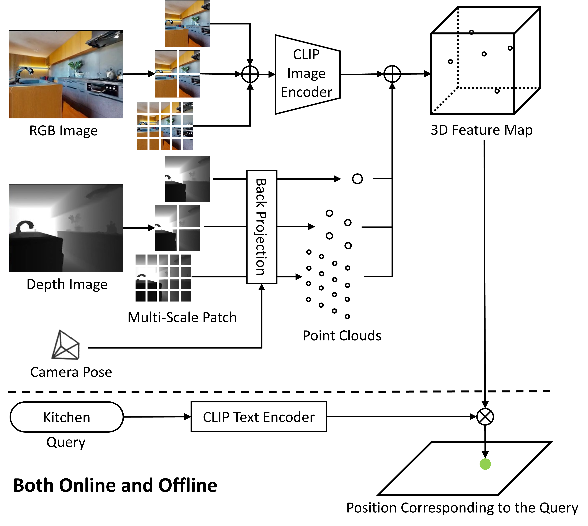

# <b>CLIPMapper</b>

## [<b>Online Embedding Multi-Scale CLIP Features into 3D Maps</b>](https://arxiv.org/pdf/2403.18178.pdf)

<b>Shun Taguchi and Hideki Deguchi</b>

`CLIPMapper` is online embedding method of multi-scale CLIP features into 3D maps. 
By harnessing CLIP, this method surpasses the constraints of conventional vocabulary-limited methods and enables the incorporation of semantic information into the resultant maps. 

# Approach



CLIPMapper divides the image into multiple patch images at multiple scales, concatenates the resulting images in the batch direction, and inputs them to the CLIP image encoder to compute the CLIP features corresponding to each patch image.

The obtained CLIP features are embedded in 3D space together with a point cloud obtained by back-projecting the depth image.

When searching for objects on the map, the search query is converted into features by the CLIP text encoder, the similarity with the embedded feature points is calculated, and points higher than a threshold value are output.

# Demo

We provide two demo scripts in `example` of chimera.

If you want to run these demos, please use HM3D datasets to follow the link:

[Access HM3D Datasets](https://github.com/facebookresearch/habitat-sim/blob/main/DATASETS.md#habitat-matterport-3d-research-dataset-hm3d)

After getting access to the dataset following above link, you can download HM3D datasets using download script:
  ```bash
  bash script/download_habitat_hm3d.sh --username <api-token-id> --password <api-token-secret>
  ```


- Open-vocabulary Object-goal Navigation

    ```
    python example/demo_open_vocabulary_objectnav.py
    ```

- Object Retrieval

    ```
    python example/demo_object_retrieval.py
    ```

# Citing CLIPMapper

If you use CLIPMapper in your research, please use the following BibTeX entry.
```
@article{taguchi2024clipmapper,
    title={Online Embedding Multi-Scale CLIP Features into 3D Maps},
    author={Shun Taguchi and Hideki Deguchi},
    journal={arXiv:2304.18178},
    year={2024}
}
```

# License

Copyright (C) 2024 TOYOTA CENTRAL R&D LABS., INC. All Rights Reserved.