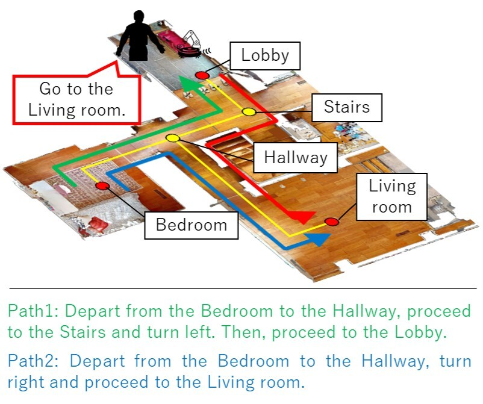
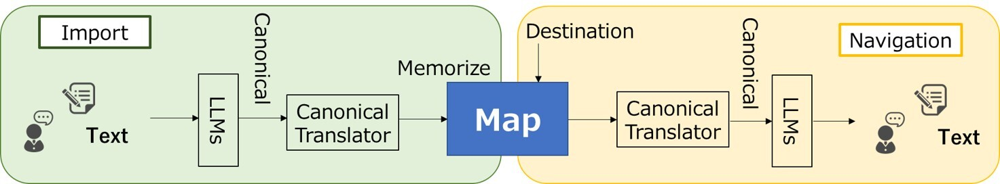

# <b>L2M</b>

## [<b>Language to Map:  Topological map generation from natural language path instructions</b>](https://arxiv.org/pdf/2403.10008)

<b>Hideki Deguchi, Kazuki Shibata and Shun Taguchi</b>



`L2M` creates a topological map with actions (forward, turn left, turn right) at each node based on natural language path instructions. 'L2M' then generates a path instruction in response to user queries about a destination.


# Approach


The figure illustrates the dataflow of the 'L2M' system. 

To create a map, our system first converts natural language instructions into a canonical information. This canonical information is then transformed into map-style data. 

For generating path instructions, 'L2M' retrieves the canonical information from the map and converts it into natural language instructions using large language models. 

For more details, please refer to our paper.


# Demo

We provide a demo script in `example` of chimera.
If you want to run this demo, please get an OpenAI API Key [here](https://openai.com/index/openai-api/) and set the `OPENAI_API_KEY` in the environment variables:
```bash
export OPENAI_API_KEY=<your-openai-api-key>
```

Please run the demo script as follows:
```
python example/demo_l2m.py
```

# Citing L2M

If you use L2M in your research, please use the following BibTeX entry.
```
@inproceedings{deguchi2024l2m,
    title={Language to Map:  Topological map generation from natural language path instructions},
    author={Hideki Deguchi and Kazuki Shibata and Shun Taguchi},
    booktitle={International Conference on Robotics and Automation (ICRA)},
    year={2024}
}
```

# License

Copyright (C) 2024 TOYOTA CENTRAL R&D LABS., INC. All Rights Reserved.
